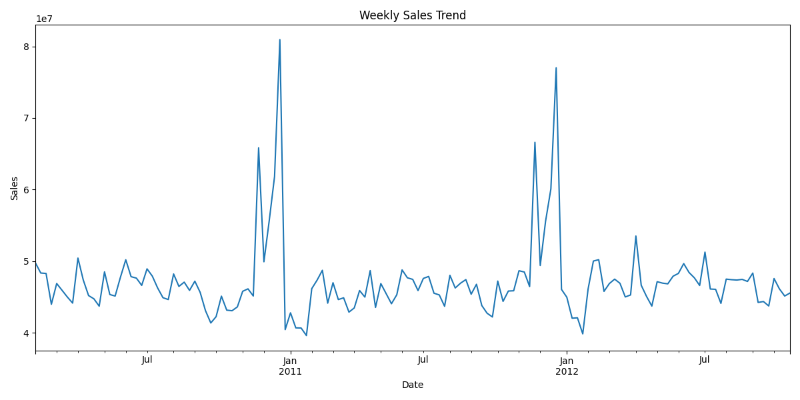
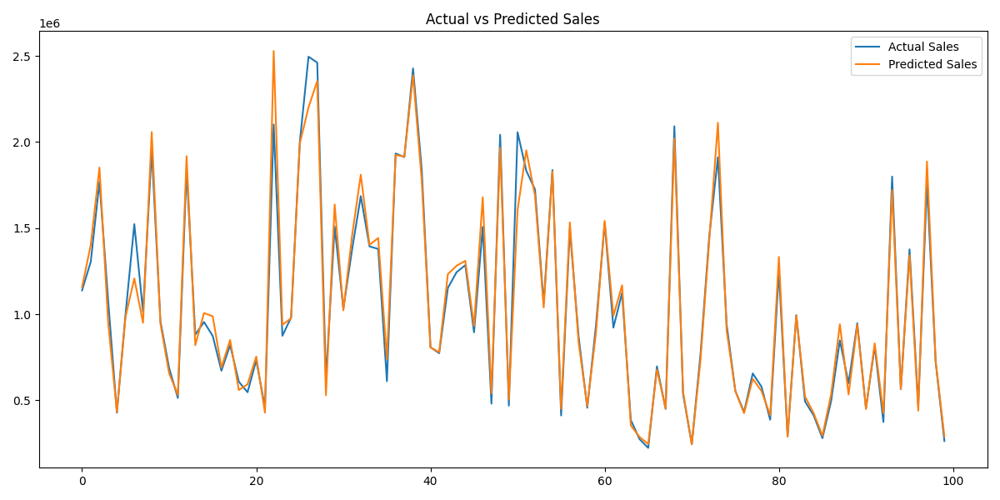
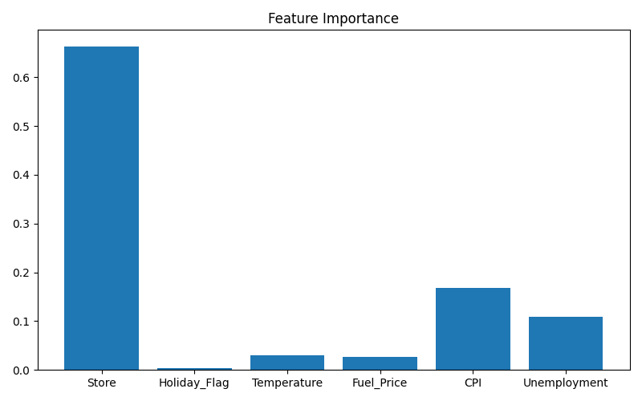
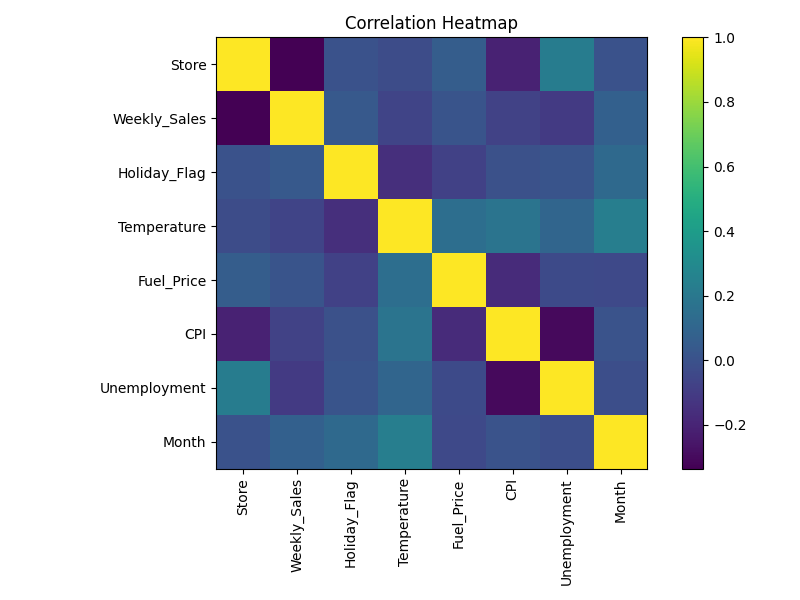
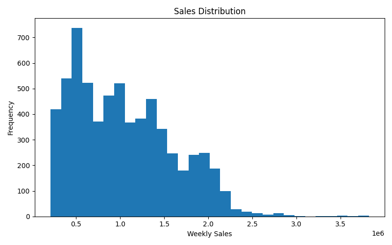
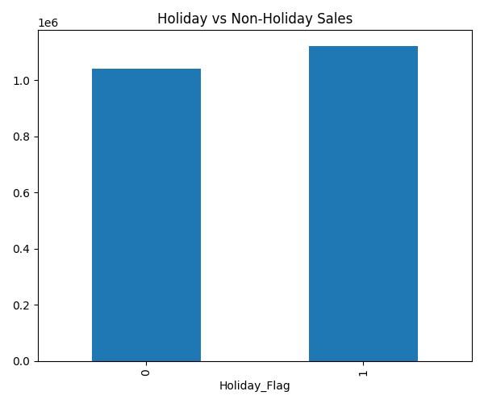
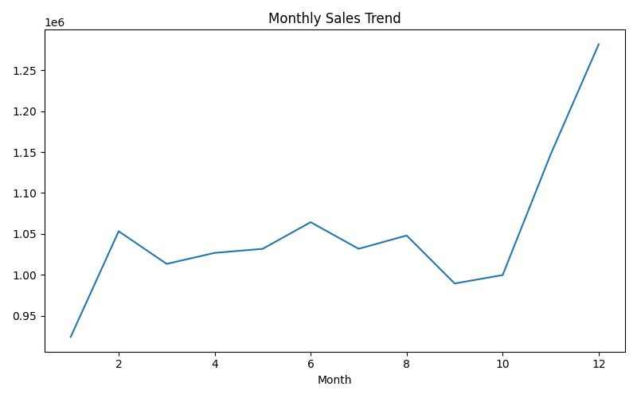

# Sales & Demand Forecasting for Businesses

## Overview

This project predicts weekly sales using historical Walmart sales data using Machine Learning.

## Model Used

Random Forest Regressor

## Performance

* MAE: 76675.4
* R² Score: 0.9326

## Visualizations

### Weekly Sales Trend

### Actual vs Predicted Sales

### Feature Importance

### Correlation Heatmap

### Sales Distribution

### Holiday vs Non-Holiday Sales

### Monthly Sales Trend

## Technologies Used

* Python
* Pandas
* NumPy
* Matplotlib
* Scikit-Learn

## Business Insights

* Holiday periods influence sales.
* Store location significantly affects weekly sales.
* CPI and unemployment impact demand.
* The model explains over 93% of sales variation.

## Project Structure

FUTURE_ML_01

├── data

├── outputs

├── insights

├── screenshots

├── main.py

├── README.md

└── requirements.txt
